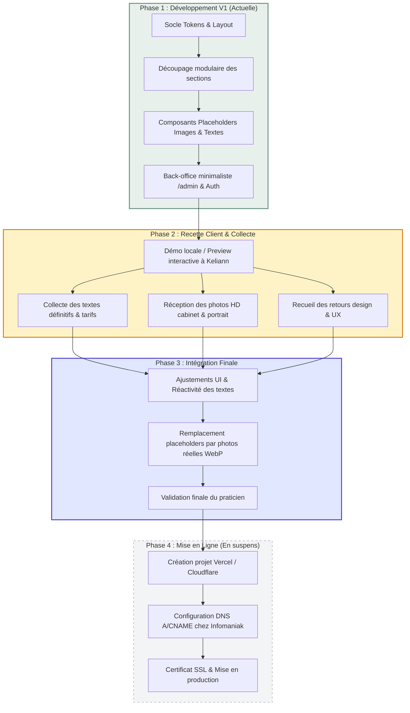

# Product Requirement Document (PRD)

## Projet : Site Vitrine Professionnel - Keliann L'Azou, Psychomotricien D.E.
- **Statut :** Phase 1 — Développement V1 (Maquette interactive & Placeholders)
- **Auteur :** Tech Lead & Product Architect
- **Cible immédiate :** Environnement local & Prévisualisation de recette client
- **Cible finale (mise en suspens) :** Déploiement Cloud (Vercel / Cloudflare) & Domaine Infomaniak
- **Version :** 1.1.0

---

## 1. Résumé Exécutif & Vision Produit

### 1.1 Contexte & Mission
Keliann L'Azou est Psychomotricien Diplômé d'État (D.E.). La psychomotricité est une profession paramédicale réglementée par le Code de la Santé Publique, exercée sur prescription médicale obligatoire.

L'objectif principal du projet est de doter Keliann d'une présence en ligne professionnelle, sobre, rassurante et ultra-performante. Le site doit servir de vitrine de réassurance pour les patients (enfants, adolescents, adultes, seniors), leurs familles (parents désorientés face à des difficultés scolaires ou de développement) et le réseau médical/paramédical (médecins généralistes, pédiatres, neuropédiatres, orthophonistes, ergothérapeutes, psychologues, enseignants).

### 1.2 Objectifs Stratégiques
1. **Clarté pédagogique :** Démystifier la psychomotricité auprès du grand public à travers une ergonomie visuelle claire (définition, champs d'application, motifs de consultation).
2. **Conversion sans friction :** Guider l'utilisateur vers la prise de rendez-vous en ligne via **Doctolib** (ou contact direct téléphone/email si les créneaux Doctolib ne sont pas encore ouverts).
3. **Point d'atterrissage carte de visite :** Assurer une vitesse d'affichage instantanée lors du scan du **QR Code** imprimé sur les cartes de visite professionnelles.
4. **Zéro friction technique & No-Overengineering :** Maintenir une maintenance quasi-nulle pour le praticien, avec un panneau d'administration minimaliste permettant d'éditer les coordonnées, horaires, tarifs et une bannière d'information temporaire (congés, déménagement).

---

## 2. Feuille de Route & Phasing du Projet (Roadmap V1)

> [!IMPORTANT]
> **Décision de cadrage produit :** Le projet ne sera **pas déployé en production ni rattaché au nom de domaine Infomaniak** dans l'immédiat. Le cycle de vie du projet est scindé en 4 phases claires afin d'intégrer les allers-retours du praticien sur les textes, photos, fonctionnalités et design.

### 2.1 Description des 4 Phases

#### Phase 1 : Socle Technique & Maquette Interactive V1 (En cours)
- Mise en place du layout complet avec design system Tailwind v4.
- Développement de l'intégralité des sections avec des **placeholders structurés** (textes temporaires réalistes et cadres photos ergonomiques).
- Implémentation du back-office `/admin` ultra-léger pour démontrer la capacité d'édition dynamique (horaires, coordonnées, alerte de congés).
- **Livrable :** Application 100% exécutable en local (`npm run dev` et `npm run build`), propre, sans bug.

#### Phase 2 : Recette Client & Collecte des Actifs Finaux
- Présentation interactive à Keliann L'Azou.
- Recueil des retours :
  - Ajustements de ton ou formulation sur les motifs de consultation et le parcours.
  - Confirmation du montant des tarifs et durées des bilans.
  - Remise des photographies officielles (portrait professionnel, vue large de la salle de motricité, vue d'entrée/accueil).
  - Remise des coordonnées exactes et liens (URL définitive Doctolib, SIRET, RPPS).

#### Phase 3 : Itération Design & Remplacement des Placeholders
- Intégration des photographies traitées (formats WebP/AVIF optimisés avec `next/image`).
- Calibrage des espacements et typographies pour s'adapter parfaitement à la longueur des textes réels.
- Validation finale du rendu par le client.

#### Phase 4 : Mise en Ligne & Domaine Infomaniak (Suspendue jusqu'à validation Phase 3)
- Création du projet de production sur Vercel (ou Cloudflare Pages).
- Configuration des enregistrements DNS (Type A et CNAME) dans le tableau de bord Infomaniak.
- Vérification du certificat SSL Let's Encrypt et tests de performance Lighthouse en conditions réelles.

---

## 3. Matrice des Contenus Attendus du Client (Checklist)

Pour faciliter le travail de collecte auprès de Keliann L'Azou lors de la Phase 2, voici la grille d'inventaire :

| Élément | Type | Statut V1 | Utilisation dans le site |
| :--- | :--- | :--- | :--- |
| **Portrait du praticien** | Photo HD (verticale ou carrée) | *Placeholder visuel avec icône* | Section "Qui suis-je ?" |
| **Salle de consultation** | Photo HD (paysage 16:9 ou 16:10) | *Placeholder visuel avec icône* | Section "Le Cabinet" (vue principale) |
| **Devanture / Accès** | Photo HD (paysage 4:3) | *Placeholder visuel avec icône* | Vignette 1 "Le Cabinet" |
| **Salle d'attente** | Photo HD (paysage 4:3) | *Placeholder visuel avec icône* | Vignette 2 "Le Cabinet" |
| **Biographie / Approche** | Texte court (2 à 3 paragraphes) | *Texte indicatif type* | Section "Qui suis-je ?" |
| **Citation inspirante** | Phrase courte + auteur | *Citation indicative type* | Bas de la section "Mes Valeurs" |
| **Lien Doctolib** | URL complète | *URL par défaut (doctolib.fr)* | Bouton Header, Hero et Footer |
| **Adresse & Accès** | Adresse postale + étage/digicode | *Adresse indicative type* | Colonne "Infos Pratiques" & Footer |
| **Horaires d'ouverture** | Tableau des créneaux par jour | *Plages indicatives 8h30-19h30* | Colonne "Infos Pratiques" |
| **Tarifs & Durées** | Bilan et séance individuelle (€) | *180 € bilan / 45 € séance* | Colonne "Infos Pratiques" |
| **Identifiants légaux** | RPPS & SIRET | *Identifiants factices sécurisés* | Mentions légales Footer |

---

## 4. Utilisateurs Cibles & Personas

| Persona | Profil & Démographie | Problématique / Besoin | Comportement sur le site | Critère de succès |
| :--- | :--- | :--- | :--- | :--- |
| **Julie (36 ans), Maman de Thomas (8 ans)** | Parent actif, sur smartphone le soir | Difficultés scolaires de son fils (écriture illisible, agitation, manque d'attention). Conseillée par l'école ou le pédiatre. | Arrive via Google ou QR Code. Cherche à comprendre si la psychomotricité correspond au profil de Thomas, vérifie la localisation, les tarifs et clique sur Doctolib. | Rassurée en < 30 secondes par les motifs de consultation et prise de contact immédiate. |
| **Dr. Martin (52 ans), Médecin Pédiatre** | Professionnel de santé local | Recherche des confrères de confiance dans sa zone géographique pour orienter ses jeunes patients. | Cherche la formation (D.E.), le numéro RPPS/ADELI, le cadre légal de prescription et la localisation exacte du cabinet. | Confirmation immédiate de la légitimité réglementaire et partage facile du lien aux parents. |
| **Maxime (28 ans), Jeune Adulte** | Étudiant ou jeune travailleur | Stress chronique, dyspraxie diagnostiquée tardivement, perte de repères corporels ou rééducation post-traumatique. | Navigation discrète, vérifie que le cabinet accueille aussi les adultes et ados. | Sentiment d'inclusivité (la psychomotricité ne s'adresse pas qu'aux tout-petits). |

---

## 5. Parcours Utilisateurs (User Journeys)

### 5.1 Parcours A : Arrivée par QR Code (Carte de visite)

---

## 6. Spécifications Fonctionnelles Détaillées

### 6.1 Header & Navigation (`#header`)
- **Logo texte & Titre :** `Keliann L'Azou` (Typographie semi-bold) + `Psychomotricien D.E.` (Badge discret vert sauge).
- **Navigation Desktop :** `#accueil`, `#qui-suis-je`, `#psychomotricite`, `#infos-pratiques`, `#contact`.
- **Navigation Mobile :** Menu tiroir tactile avec fermeture au clic d'ancre.
- **CTA Header :** Bouton `Prendre RDV` vers Doctolib.
- **Comportement :** `sticky top-0`, fond translucide avec glassmorphism (`backdrop-blur-md`).

### 6.2 Bannière d'Alerte Dynamique (Optionnelle)
- **Position :** Au-dessus du Header.
- **Comportement :** Affichée uniquement si `alertBanner.enabled === true`.
- **Cas d'usage :** "Cabinet fermé pour congés du X au Y", "Ouverture de nouveaux créneaux".

### 6.3 Hero Banner (`#accueil`)
- **Titre H1 :** Clair, humain et rassurant.
- **Sous-titre explicatif :** Présentation du rôle de Keliann L'Azou.
- **Double CTA :** Bouton Doctolib + Lien d'ancrage `#infos-pratiques`.
- **Visuel d'ambiance :** Cadre visuel soigné prêt à recevoir la photo d'ambiance.

### 6.4 Bandeau des 4 Piliers Fondamentaux
1. Motricité globale & fine
2. Graphisme & Apprentissages
3. Régulation émotionnelle
4. Confiance & Conscience corporelle

### 6.5 Section "Qui suis-je ?" (`#qui-suis-je`)
- Texte de présentation du parcours universitaire et de la philosophie de soin.
- **Encadré Réglementaire :** Obligation stricte de prescription médicale (Code de la Santé Publique).
- Photo portrait professionnelle du praticien.

### 6.6 Section "Mes Valeurs" & Citation Inspirante
- Grille de 3 cartes : Écoute & Bienveillance, Approche Holistique, Travail en Réseau.
- Citation inspirante sur le mouvement et le langage du corps.

### 6.7 Section "La Psychomotricité" (`#psychomotricite`)
- Définition pédagogique de la discipline.
- Sous-bloc "Pour qui ?" (3 cartes : Enfants, Adolescents, Adultes & Seniors).
- Sous-bloc "Dans quelles situations consulter ?" (8 motifs de consultation avec icônes et descriptions).

### 6.8 Section "Informations pratiques & Le Cabinet" (`#infos-pratiques`)
- Adresse physique avec lien interactif Google Maps.
- Horaires d'ouverture par jour.
- Tarifs indicatifs (Bilan et séance).
- Modalités de prise en charge (Mutuelles et MDPH).
- Galerie photo : 1 photo principale salle de motricité + 2 vignettes (façade, salle d'attente).

### 6.9 Section "Me Contacter" & Footer (`#contact`)
- Coordonnées directes (téléphone, email cliquable).
- Bouton Doctolib.
- Mentions légales (RPPS, SIRET, hébergeur, conformité RGPD).
- Lien discret vers l'espace praticien `/admin`.

---

## 7. Back-Office Simplifié (No-Overengineering)

### 7.1 Philosophie
Pas de CMS headless complexe ni de blog. Une interface unique sécurisée permettant d'éditer la bannière d'alerte, les coordonnées, les tarifs et les horaires.

### 7.2 Champs Éditables
1. Bannière d'alerte (activation, message, type).
2. Contact (téléphone, email, adresse, lien Maps, lien Doctolib).
3. Horaires d'ouverture.
4. Tarifs (bilan, séance, note de remboursement).
5. Note de prescription.

---

## 8. Exigences Non-Fonctionnelles & Performance

| Critère | Cible | Moyen mis en œuvre |
| :--- | :--- | :--- |
| **Performance (Lighthouse)** | Score ≥ 95 | Server Components React 19, zéro bundle inutile, Tailwind v4. |
| **First Contentful Paint (FCP)** | < 1.0s | Polices optimisées via `next/font`, CSS inline critique. |
| **Cumulative Layout Shift (CLS)** | 0.00 | Ratios d'aspect réservés pour les photos. |
| **Accessibilité (a11y)** | Conforme WCAG 2.1 AA | Contrastes > 4.5:1, navigation clavier fluide, balises ARIA. |
| **Données de santé (RGPD)** | 100% conforme | **Aucune donnée médicale n'est hébergée sur le site.** Prise de RDV déléguée à Doctolib. |
