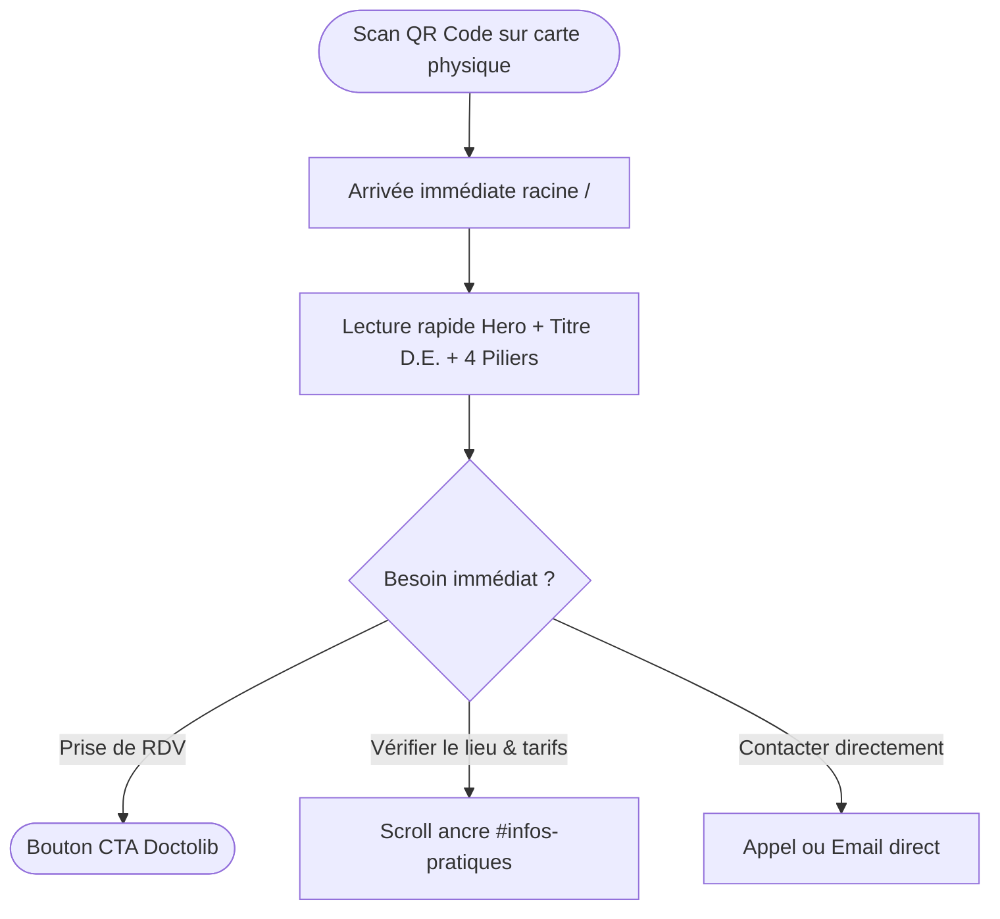

# Product Requirement Document (PRD)

## Projet : Site Vitrine Professionnel - Keliann L'Azou, Psychomotricien D.E.
- **Statut :** Validé / En cours de développement
- **Auteur :** Tech Lead & Product Architect
- **Cible :** Production Web & Déploiement Cloud (Vercel / Cloudflare Pages)
- **Version :** 1.0.0

---

## 1. Résumé Exécutif & Vision Produit

### 1.1 Contexte & Mission
Keliann L'Azou est Psychomotricien Diplômé d'État (D.E.). La psychomotricité est une profession paramédicale réglementée par le Code de la Santé Publique, exercée sur prescription médicale obligatoire.

L'objectif principal du projet est de doter Keliann d'une présence en ligne professionnelle, sobre, rassurante et ultra-performante. Le site doit servir de vitrine de réassurance pour les patients (enfants, adolescents, adultes, seniors), leurs familles (parents désorientés face à des difficultés scolaires ou de développement) et le réseau médical/paramédical (médecins généralistes, pédiatres, neuropédiatres, orthophonistes, ergothérapeutes, psychologues, enseignants).

### 1.2 Objectifs Stratégiques
1. **Clarté pédagogique :** Démystifier la psychomotricité auprès du grand public à travers une ergonomie visuelle claire (définition, champs d'application, motifs de consultation).
2. **Conversion sans friction :** Guider l'utilisateur vers la prise de rendez-vous en ligne via **Doctolib** (ou contact direct téléphone/email si les créneaux Doctolib ne sont pas encore ouverts).
3. **Point d'atterrissage carte de visite :** Assurer une vitesse d'affichage instantanée lors du scan du **QR Code** imprimé sur les cartes de visite professionnelles.
4. **Zéro friction technique & No-Overengineering :** Maintenir une maintenance quasi-nulle pour le praticien, avec un panneau d'administration minimaliste permettant d'éditer les coordonnées, horaires, tarifs et une bannière d'information temporaire (congés, déménagement).

---

## 2. Utilisateurs Cibles & Personas

| Persona | Profil & Démographie | Problématique / Besoin | Comportement sur le site | Critère de succès |
| :--- | :--- | :--- | :--- | :--- |
| **Julie (36 ans), Maman de Thomas (8 ans)** | Parent actif, sur smartphone le soir | Difficultés scolaires de son fils (écriture illisible, agitation, manque d'attention). Conseillée par l'école ou le pédiatre. | Arrive via Google ou QR Code. Cherche à comprendre si la psychomotricité correspond au profil de Thomas, vérifie la localisation, les tarifs et clique sur Doctolib. | Rassurée en < 30 secondes par les motifs de consultation et prise de contact immédiate. |
| **Dr. Martin (52 ans), Médecin Pédiatre** | Professionnel de santé local | Recherche des confrères de confiance dans sa zone géographique pour orienter ses jeunes patients. | Cherche la formation (D.E.), le numéro RPPS/ADELI, le cadre légal de prescription et la localisation exacte du cabinet. | Confirmation immédiate de la légitimité réglementaire et partage facile du lien aux parents. |
| **Maxime (28 ans), Jeune Adulte** | Étudiant ou jeune travailleur | Stress chronique, dyspraxie diagnostiquée tardivement, perte de repères corporels ou rééducation post-traumatique. | Navigation discrète, vérifie que le cabinet accueille aussi les adultes et ados. | Sentiment d'inclusivité (la psychomotricité ne s'adresse pas qu'aux tout-petits). |

---

## 3. Parcours Utilisateurs (User Journeys)

### 3.1 Parcours A : Arrivée par QR Code (Carte de visite)

### 3.2 Parcours B : Parent orienté par l'école / le pédiatre
1. Arrivée sur la page d'accueil via recherche locale ou lien partagé.
2. Lecture du bandeau d'alerte éventuel (ex: "Cabinet ouvert - Prise de RDV disponible").
3. Scroll vers la section **"La Psychomotricité"** > vérification des cartes **"Dans quelles situations consulter ?"** (repérage immédiat du motif : *Graphisme, TDA/H, Maladresse*).
4. Validation du cadre médical : le site rappelle la nécessité d'une **prescription médicale**.
5. Clic sur le CTA fixe ou flottant **"Prendre RDV sur Doctolib"**.

---

## 4. Spécifications Fonctionnelles Détaillées

Le site est conçu comme une **Single Page Application (SPA)** défilante avec ancrage fluide (`scroll-behavior: smooth`) et gestion dynamique d'une bannière d'annonce.

### 4.1 Header & Navigation (`#header`)
- **Logo texte & Titre :** `Keliann L'Azou` (Typographie semi-bold) + `Psychomotricien D.E.` (Badge ou sous-titre discret vert sauge).
- **Navigation Desktop :**
  - `#accueil` : Accueil
  - `#qui-suis-je` : Le Praticien
  - `#psychomotricite` : La Psychomotricité
  - `#infos-pratiques` : Cabinet & Tarifs
  - `#contact` : Contact
- **Navigation Mobile :** Menu tiroir (Burger menu accessible, touch-friendly, fermeture automatique au clic sur une ancre).
- **CTA Header :** Bouton mis en avant `Prendre RDV` avec icône calendrier / externe vers Doctolib.
- **Comportement :** `sticky top-0`, fond translucide blanc crème avec effet glassmorphism (`backdrop-blur-md`), ombre subtile au scroll.

### 4.2 Bannière d'Alerte Dynamique (Optionnelle)
- **Position :** Tout en haut du viewport (au-dessus du Header) ou intégrée juste sous la navbar.
- **Comportement :** Affichée uniquement si le paramètre `alert_enabled` est actif en base/configuration.
- **Cas d'usage :** "Cabinet fermé pour congés du 12 au 26 août", "Ouverture de nouveaux créneaux le mercredi après-midi".
- **Styles :** Fond vert sauge doux ou ambré discret, texte lisible, bouton de fermeture optionnel.

### 4.3 Hero Section (`#accueil`)
- **Titre H1 :** Clair, humain et rassurant (ex. : *"Prendre soin du corps et de l'esprit par le mouvement"* ou *"Accompagner le développement psychomoteur à chaque étape de la vie"*).
- **Sous-titre explicatif :** Présentation du rôle de Keliann L'Azou, cabinet situé à [Ville/Quartier], prise en charge sur-mesure d'enfants, adolescents et adultes.
- **Double CTA :**
  - **CTA Primaire :** `Prendre rendez-vous` (Lien direct vers Doctolib avec attributs `rel="noopener noreferrer"`).
  - **CTA Secondaire :** `Voir le cabinet & Localisation` (Ancre douce vers `#infos-pratiques`).
- **Visuel d'ambiance :** Image douce et lumineuse représentant l'espace thérapeutique, matériel sensoriel ou dessin épuré illustrant la motricité.

### 4.4 Bandeau des 4 Piliers Fondamentaux
Disposé immédiatement sous le Hero pour poser les repères clés :
1. **Motricité globale & fine :** Coordination, équilibre, dissociation, tonus, motricité manuelle.
2. **Graphisme & Apprentissages :** Tenue du crayon, aisance graphique, repérage spatio-temporel.
3. **Régulation émotionnelle :** Gestion du stress, anxiété corporelle, hypersensibilité, inhibition.
4. **Confiance & Conscience corporelle :** Image du corps, affirmation de soi, autonomie au quotidien.
- **Rendu :** Puces rondes / pastilles aérées avec micro-icônes douces (Lucide React) et typographie apaisante.

### 4.5 Section "Qui suis-je ?" (`#qui-suis-je`)
Disposition sur 2 colonnes desktop (responsive 1 colonne mobile) :
- **Colonne Gauche (Texte & Éthique) :**
  - Parcours et diplôme : Diplôme d'État de Psychomotricien (obtenu après formation universitaire agréée).
  - Approche thérapeutique bienveillante et ludique.
  - **Encadré Réglementaire (Déontologie) :** Rappel officiel : *"Conformément à la réglementation française, le bilan et le suivi psychomoteur sont réalisés exclusivement sur prescription médicale de votre médecin traitant ou spécialiste."*
- **Colonne Droite (Visuel) :**
  - Photographie professionnelle de Keliann en cabinet, souriant et accueillant.
  - Badge incrusté : "Praticien Conventionné - Diplômé d'État".

### 4.6 Section "Mes Valeurs" & Citation Inspirante
- **Grille de 3 Cartes :**
  1. *Écoute & Bienveillance :* Un espace sécurisant où l'enfant ou l'adulte progresse sans jugement.
  2. *Approche Holistique :* Intégration globale du corps, des émotions et des fonctions cognitives.
  3. *Co-construction & Réseau :* Travail étroit avec la famille, l'école et l'équipe pluridisciplinaire.
- **Bloc Citation :** Typographie stylisée type citation humaniste (ex. inspirée de Julian de Ajuriaguerra ou Giselle Soubiran sur le dialogue corporel).

### 4.7 Section "La Psychomotricité" (`#psychomotricite`)
- **Bloc 1 : Définition & Schéma Visuel :**
  - Explication simple : thérapie corporelle qui aide à harmoniser le corps, les émotions et la pensée.
  - Schéma visuel synthétique : Triangle interactionnel `Corps - Émotion - Cognition`.
- **Bloc 2 : "Pour qui ?" (3 cartes distinctes) :**
  1. *Enfants :* Retards de développement moteur, prématurité, troubles des apprentissages (DYS), TDA/H, agitation.
  2. *Adolescents :* Mal-être corporel, troubles anxieux, manque de repères spatio-temporels, perte de confiance.
  3. *Adultes & Seniors :* Gestion du stress, troubles du schéma corporel, rééducation neurologique, prévention des chutes.
- **Bloc 3 : "Dans quelles situations consulter ?" :**
  - Grille responsive de 8 motifs majeurs :
    1. Troubles de la coordination motrice (TDC / Dyspraxie)
    2. Difficultés d'écriture et graphisme (Dysgraphie)
    3. TDA/H, impulsivité et difficultés attentionnelles
    4. Maladresse motrice et troubles de l'équilibre
    5. Difficultés d'organisation spatiale et temporelle
    6. Troubles du tonus (hypertonie, hypotonie, tics)
    7. Anxiété, inhibition corporelle, manque d'assurance
    8. Retard dans les acquisitions motrices chez le jeune enfant

### 4.8 Section "Informations pratiques & Le Cabinet" (`#infos-pratiques`)
Disposition sur 2 colonnes ergonomiques :
- **Colonne de gauche (Détails logistiques) :**
  - **Adresse physique :** Adresse du cabinet avec bouton d'ouverture direct dans Google Maps / Apple Maps.
  - **Horaires :** Plages d'ouverture claires (ex. Lundi au Vendredi 8h30 - 19h00, Samedi matin).
  - **Tarifs indicatifs :**
    - Bilan psychomoteur initial (passation de tests standardisés, rédaction du compte-rendu, restitution aux familles).
    - Séance de suivi psychomoteur (durée standard 40 à 45 minutes).
  - **Modalités de remboursement :** Rappel pédagogique indiquant que les actes ne sont pas remboursés par la Sécurité Sociale de base, mais font l'objet d'une prise en charge fréquente par les **mutuelles complémentaires** ou par des dossiers **MDPH** (complément AEEH/PCH).
- **Colonne de droite (Galerie photos du cabinet) :**
  - 1 photo principale grand format : Espace de consultation lumineux avec tapis et modules moteurs.
  - 2 vignettes d'ambiance : Entrée / façade du cabinet et salle d'attente accueillante.

### 4.9 Section "Me Contacter" & Footer (`#contact`)
- **Coordonnées directes :**
  - Numéro de téléphone cliquable (`tel:+33...`).
  - Adresse email professionnelle cliquable (`mailto:...`).
  - Bouton proéminent "Prendre RDV sur Doctolib".
- **Mentions légales & Conformité réglementaire :**
  - Numéro RPPS / ADELI du praticien.
  - Numéro SIRET du cabinet.
  - Mention d'appartenance à une association de gestion agréée (le cas échéant).
  - Nom de l'hébergeur web et politique de confidentialité (RGPD : absence de cookies traceurs publicitaires, pas de données de santé hébergées sur le site vitrine).
  - Copyright © 2026 Keliann L'Azou. Tous droits réservés.

---

## 5. Back-Office Simplifié (Administration Sans Overengineering)

### 5.1 Philosophie : "Set and Forget"
Le site ne comporte pas d'articles de blog à alimenter régulièrement. Le praticien ne doit pas perdre de temps avec un CMS lourd (WordPress, Strapi, Sanity). L'objectif est une page unique d'administration protégée pour mettre à jour les constantes du cabinet.

### 5.2 Champs Éditables
1. **Bannière d'alerte :** Activer/Désactiver (booléen) + Message textuel court.
2. **Coordonnées :** Numéro de téléphone, adresse email, adresse postale complète, lien URL Google Maps.
3. **Lien de prise de RDV :** URL Doctolib (permet de basculer vers un lien de pré-inscription ou téléphone si le compte Doctolib est en cours de création).
4. **Horaires d'ouverture :** Texte libre ou tableau de plages horaires.
5. **Tarifs :** Montant du bilan et montant de la séance de suivi.
6. **Note de prescription :** Texte personnalisable rappelant les modalités d'ordonnance.

### 5.3 Sécurité d'accès
- Route protégée `/admin`.
- Authentification par mot de passe maître unique défini dans une variable d'environnement (`ADMIN_PASSWORD`), hashé ou validé via cookie de session sécurisé (`httpOnly`, `sameSite=strict`, `secure`).

---

## 6. Exigences Non-Fonctionnelles & Performance

| Critère | Cible | Moyen mis en œuvre |
| :--- | :--- | :--- |
| **Performance (Lighthouse)** | Score ≥ 95 sur Mobile et Desktop | Server Components React 19, zéro JS tiers inutile, Tailwind v4 optimisé. |
| **First Contentful Paint (FCP)** | < 1.0 seconde | Pré-rendu statique (SSG/ISR), polices auto-hébergées avec `next/font`. |
| **Largest Contentful Paint (LCP)** | < 1.5 seconde | Images servies en WebP/AVIF via `next/image` avec `priority` sur l'image Hero. |
| **Cumulative Layout Shift (CLS)** | 0.00 | Tailles des conteneurs d'images réservées, styles inline critiques. |
| **Accessibilité (a11y)** | Conforme WCAG 2.1 AA | Ratios de contraste ≥ 4.5:1 sur les textes, balises ARIA sur les boutons d'ancrage, navigation au clavier. |
| **Données de santé (RGPD)** | 100% conforme | **Aucune donnée médicale de patient n'est collectée ou stockée sur le site.** Toute prise de RDV est déléguée à Doctolib (hébergeur certifié HDS). |

---

## 7. Indicateurs de Succès (KPIs)
1. **Taux de clic vers Doctolib (Conversion CTA) :** > 12% des visiteurs uniques cliquent sur le bouton de prise de rendez-vous.
2. **Taux de rebond lors du scan QR Code :** < 25% (l'information clé est vue immédiatement sans quitter la page).
3. **Temps de chargement mobile sur réseau 4G :** < 1.2s.
4. **Temps d'administration mensuel :** < 5 minutes (maintenance quasi-nulle).
