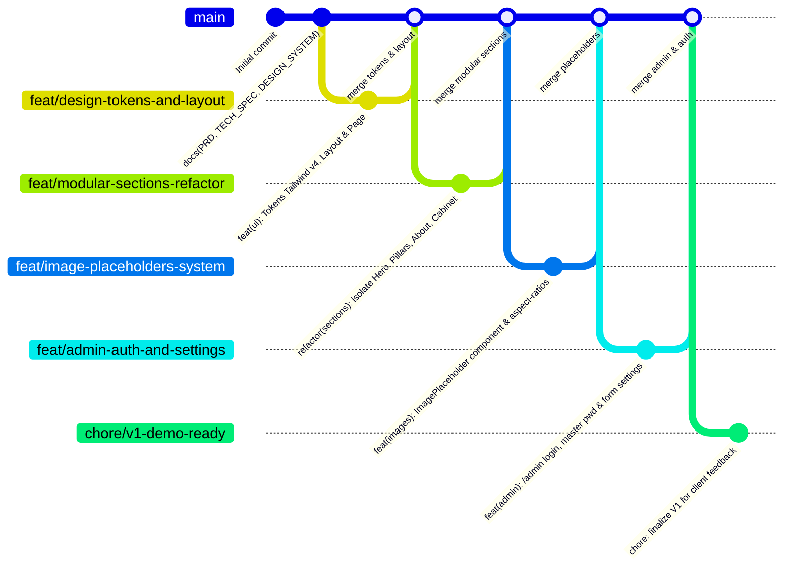

# Technical Specification & Data Architecture (TECH_SPEC.md)

## Projet : Site Vitrine Professionnel - Keliann L'Azou, Psychomotricien D.E.
- **Rôle :** Tech Lead & System Architect
- **Version :** 1.1.0
- **Statut d'exécution :** Phase 1 — Développement V1 Local & Itératif
- **Déploiement en production & DNS :** Mis en suspens temporairement dans l'attente des contenus finaux

---

## 1. Feuille de Route Technique & Enchaînement des Branches Git (V1)

Pour garantir une architecture modulaire et un historique Git irréprochable, le développement de la V1 suit un découpage strict par branches de fonctionnalités dérivées de `main`.



### 1.1 Détail des Étapes de Développement V1

| Étape | Branche Git | Objectif Technique | Dépendances & Livrables | Statut |
| :--- | :--- | :--- | :--- | :--- |
| **Étape 1** | `feat/design-tokens-and-layout` | Tokens Tailwind v4 (`globals.css`), Layout racine, `Navbar` responsive, `AlertBanner`, `Footer` déontologique. | `lucide-react`, `zod`, `clsx`, `tailwind-merge`. | ✅ **Terminé & fusionné** |
| **Étape 2** | `feat/modular-sections-refactor` | Découper `page.tsx` en composants autonomes et maintenables dans `src/components/sections/` (`HeroSection`, `PillarsSection`, `AboutSection`, `ValuesSection`, `PsychomotSection`, `CabinetSection`). | Props typées `SiteSettings`, Server Components isolés. | ⏳ **Étape suivante** |
| **Étape 3** | `feat/image-placeholders-system` | Créer un composant réutilisable `<ImagePlaceholder />` avec gestion des ratios standards (4:5 portrait, 16:10 cabinet, 4:3 vignettes), shimmer effect et fallback SVG doux. | Prêt pour le switch `next/image` en Phase 3. | ⏳ À venir |
| **Étape 4** | `feat/admin-auth-and-settings` | Implémenter `/admin/login` avec vérification du mot de passe maître en temps constant, cookie session HttpOnly, formulaire d'édition des paramètres `/admin` avec React Hook Form. | `crypto.timingSafeEqual`, cookies de session. | ⏳ À venir |
| **Étape 5** | `chore/v1-demo-ready` | Audit de performance local, tests responsive (mobile 375px, tablette 768px, desktop 1280px), documentation du guide de présentation pour Keliann. | Build de production sans erreur, prêt pour démo. | ⏳ À venir |
| **Phase 2 (Itération)** | *Branche selon retours* | Intégration des retours client : textes réels, ajustements typographiques ou fonctionnels. | Retours Keliann L'Azou. | ⏸️ Post-démo |
| **Phase 3 (Finalisation)** | `feat/real-content-integration` | Remplacement des placeholders par les photographies HD finales (converties en WebP) et validation finale. | Photos HD livrées. | ⏸️ Post-démo |
| **Phase 4 (Mise en ligne)** | `chore/production-deployment` | Déploiement Vercel / Cloudflare et configuration DNS A/CNAME chez Infomaniak. | **En suspens jusqu'à validation finale.** | ⏸️ En suspens |

---

## 2. Architecture des Données & Stratégie des Placeholders

### 2.1 Gestion des Données Textuelles Temporaires
Le fichier [`src/data/default-settings.json`](file:///Users/max/Desktop/Pro/psychomot/site-keliann-psychomot/src/data/default-settings.json) contient des textes réalistes et crédibles conçus spécialement pour la psychomotricité :
- Présentation déontologique conforme au décret n° 88-659 du Code de la Santé Publique.
- 8 motifs de consultation concrets (TDC, dysgraphie, TDA/H, repérage spatio-temporel, tonus).
- Tarifs indicatifs (180 € bilan / 45 € séance) et mention explicite de remboursement mutuelle/MDPH.
- Horaires et coordonnées réalistes.

Ces données sont injectées dans les composants via `getSiteSettings()` défini dans [`src/lib/settings.ts`](file:///Users/max/Desktop/Pro/psychomot/site-keliann-psychomot/src/lib/settings.ts).

### 2.2 Composant `<ImagePlaceholder />` et Ratios d'Aspect Réservés
Pour éviter tout effet de décalage de mise en page (*Cumulative Layout Shift - CLS = 0.00*) lorsque les vraies photos seront insérées :
- **Portrait du praticien :** Format vertical **4:5** (ou 1:1 mobile).
- **Grande vue du cabinet :** Format paysage **16:10** ou **16:9**.
- **Vignettes cabinet & façade :** Format paysage **4:3**.

Le composant de placeholder affiche une teinte vert sauge très douce (`bg-sage-50`), une bordure fine (`border border-[#E8E4DC]`), une icône thématique Lucide et un libellé d'aide clair (ex: *"Emplacement Photo Portrait Keliann L'Azou - Format 4:5"*).

---

## 3. Schéma de Données TypeScript Central (`SiteSettings`)

```typescript
import { z } from "zod";

export const siteSettingsSchema = z.object({
  alertBanner: z.object({
    enabled: z.boolean(),
    message: z.string().max(250),
    variant: z.enum(["info", "warning", "holiday"]).default("info"),
  }),
  contact: z.object({
    fullName: z.string().min(1),
    title: z.string().min(1),
    phone: z.string(),
    email: z.string().email(),
    address: z.object({
      street: z.string().min(1),
      postalCode: z.string().min(4),
      city: z.string().min(1),
      complement: z.string().optional(),
    }),
    googleMapsUrl: z.string().url(),
    doctolibUrl: z.string().url(),
  }),
  openingHours: z.array(
    z.object({
      day: z.string(),
      slots: z.string(),
    })
  ),
  pricing: z.object({
    bilan: z.object({
      amount: z.number().positive(),
      label: z.string(),
      description: z.string(),
    }),
    seance: z.object({
      amount: z.number().positive(),
      label: z.string(),
      duration: z.string(),
    }),
    reimbursementNote: z.string(),
  }),
  prescriptionNote: z.string(),
  legal: z.object({
    rpps: z.string(),
    siret: z.string(),
    legalStatus: z.string(),
    host: z.string(),
  }),
});

export type SiteSettings = z.infer<typeof siteSettingsSchema>;
```

---

## 4. Spécifications du Back-Office Minimaliste (`/admin`)

### 4.1 Authentification par Mot de Passe Maître
- **Objectif :** Zéro gestion d'utilisateurs complexe.
- **Accès :** `/admin/login`.
- **Validation :** Comparaison de chaîne sécurisée via `crypto.timingSafeEqual` avec `process.env.ADMIN_PASSWORD`.
- **Session :** Cookie `admin_session` chiffré ou signé avec `process.env.AUTH_SECRET`, sécurisé (`httpOnly`, `sameSite: "lax"`, `path: "/"`).

### 4.2 Endpoints API
- `POST /api/auth/login` : Vérifie le mot de passe et crée la session.
- `POST /api/auth/logout` : Détruit le cookie de session.
- `GET /api/settings` : Récupère la configuration courante.
- `PUT /api/settings` : Met à jour la configuration et purge le cache ISR (`revalidateTag("settings")`).

---

## 5. Stratégie de Démonstration Locale (Sans Déploiement Cloud)

En attendant la validation par le praticien :
1. **Exécution locale :** Le site s'exécute sur machine locale via `npm run dev` (port 3000).
2. **Preview partagée sans DNS (si nécessaire pour le client) :**
   - Possibilité de déployer un aperçu temporaire sur une URL automatique Vercel (`*.vercel.app`) sans lier le nom de domaine Infomaniak.
   - Ou partage local via tunnel temporaire (ex. `localtunnel` ou `ngrok`).
3. **Mise en suspens explicite de la configuration DNS Infomaniak :**
   - Aucune modification de la zone DNS d'Infomaniak ne sera effectuée tant que les textes et photos ne sont pas validés.
